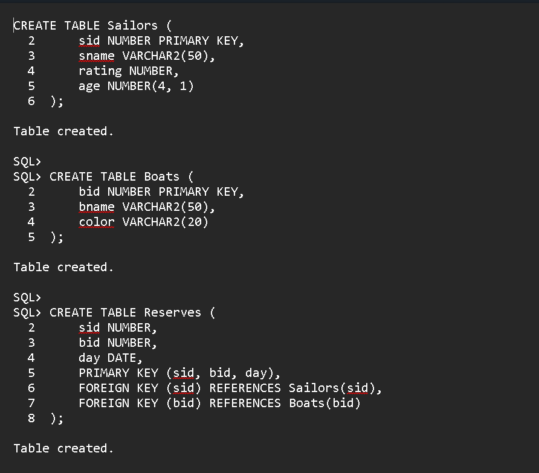
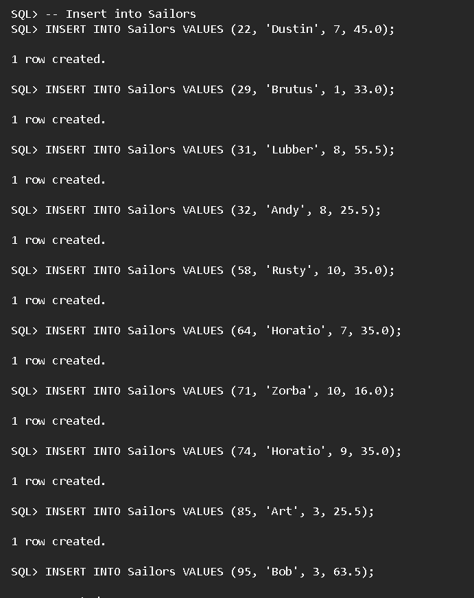
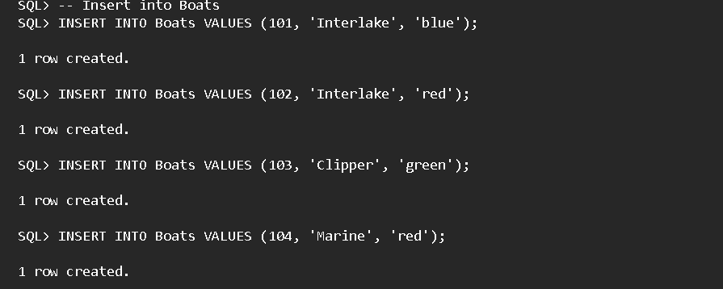
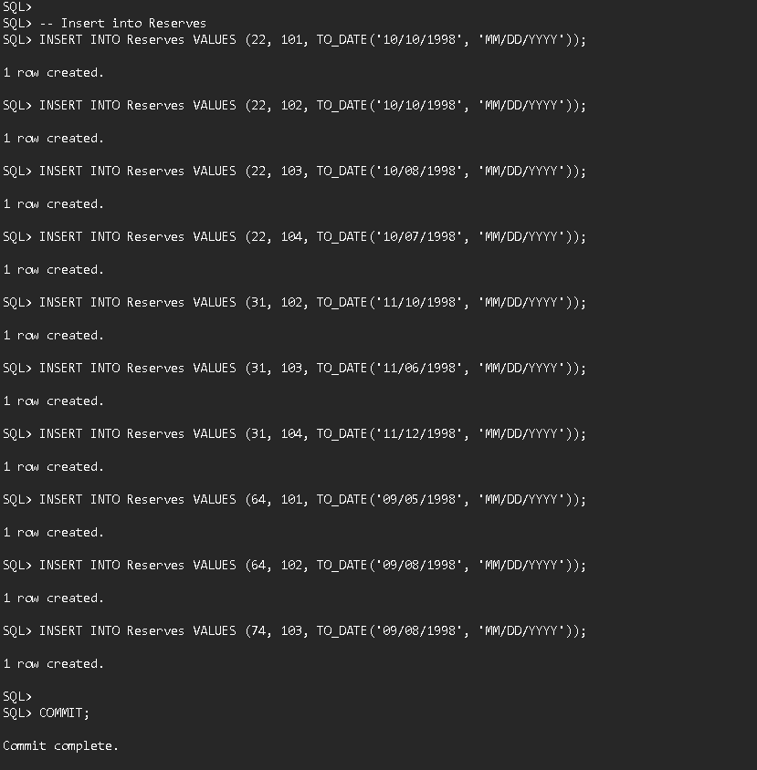
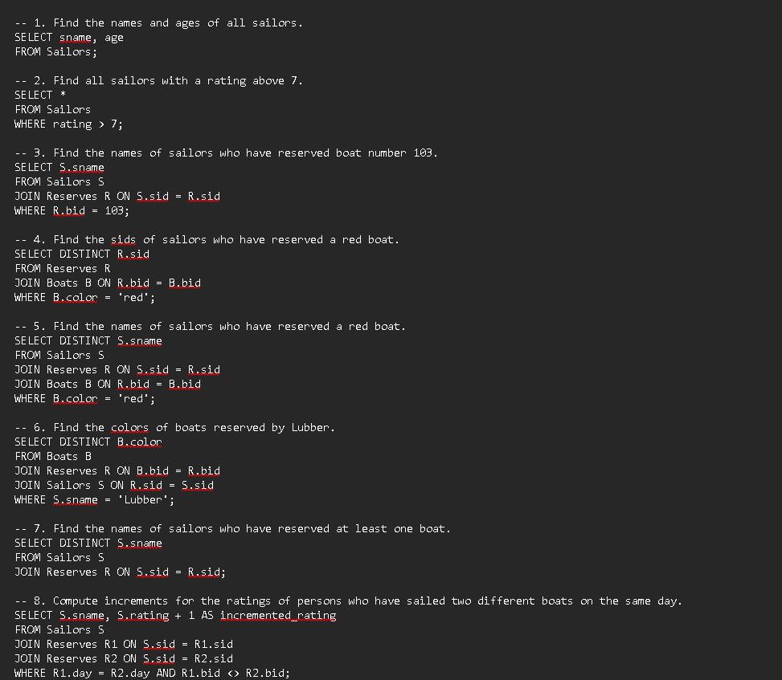
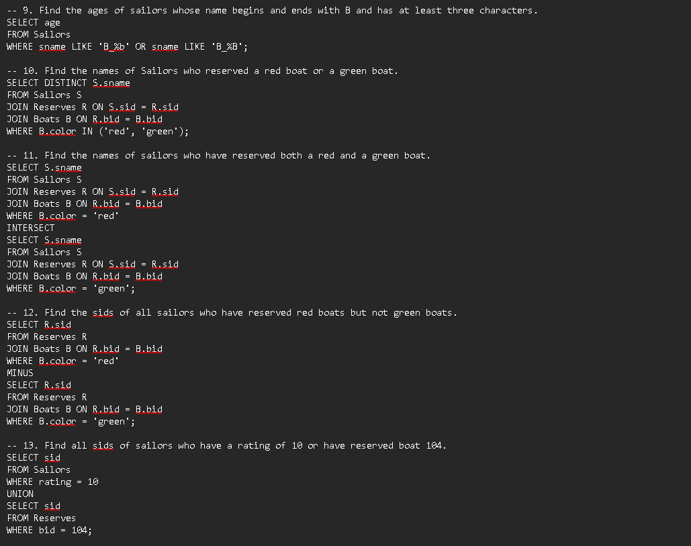
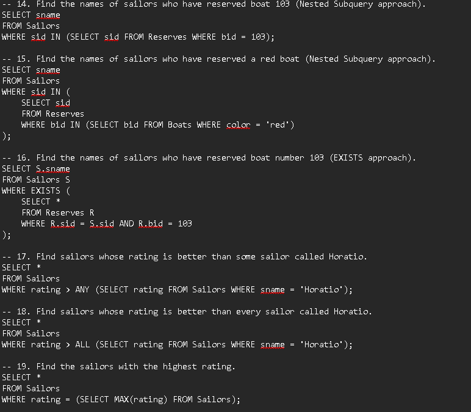
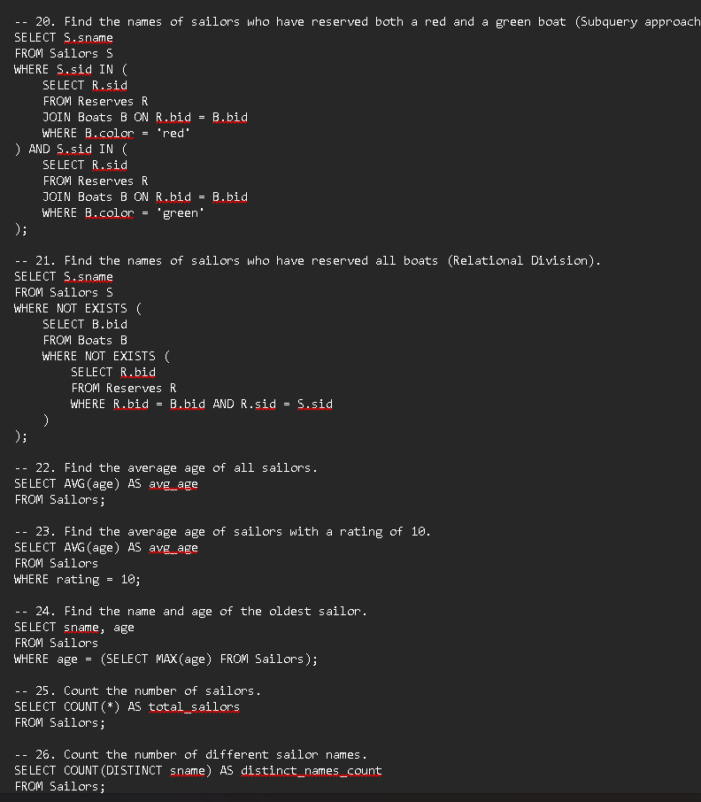
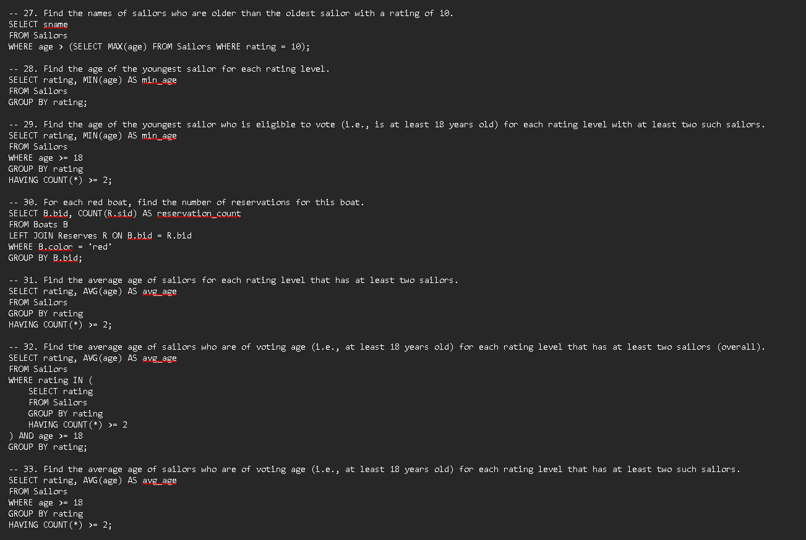
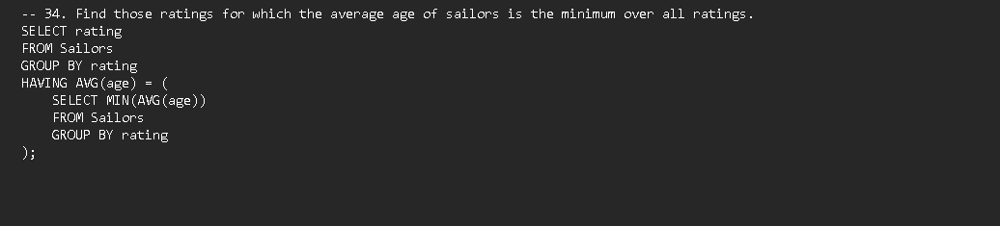

CREATE TABLE Sailors (
  2      sid NUMBER PRIMARY KEY,
  3      sname VARCHAR2(50),
  4      rating NUMBER,
  5      age NUMBER(4, 1)
  6  );

Table created.

SQL>
SQL> CREATE TABLE Boats (
  2      bid NUMBER PRIMARY KEY,
  3      bname VARCHAR2(50),
  4      color VARCHAR2(20)
  5  );

Table created.

SQL>
SQL> CREATE TABLE Reserves (
  2      sid NUMBER,
  3      bid NUMBER,
  4      day DATE,
  5      PRIMARY KEY (sid, bid, day),
  6      FOREIGN KEY (sid) REFERENCES Sailors(sid),
  7      FOREIGN KEY (bid) REFERENCES Boats(bid)
  8  );

Table created.

SQL> -- Insert into Sailors
SQL> INSERT INTO Sailors VALUES (22, 'Dustin', 7, 45.0);

1 row created.

SQL> INSERT INTO Sailors VALUES (29, 'Brutus', 1, 33.0);

1 row created.

SQL> INSERT INTO Sailors VALUES (31, 'Lubber', 8, 55.5);

1 row created.

SQL> INSERT INTO Sailors VALUES (32, 'Andy', 8, 25.5);

1 row created.

SQL> INSERT INTO Sailors VALUES (58, 'Rusty', 10, 35.0);

1 row created.

SQL> INSERT INTO Sailors VALUES (64, 'Horatio', 7, 35.0);

1 row created.

SQL> INSERT INTO Sailors VALUES (71, 'Zorba', 10, 16.0);

1 row created.

SQL> INSERT INTO Sailors VALUES (74, 'Horatio', 9, 35.0);

1 row created.

SQL> INSERT INTO Sailors VALUES (85, 'Art', 3, 25.5);

1 row created.

SQL> INSERT INTO Sailors VALUES (95, 'Bob', 3, 63.5);

1 row created.

SQL>
SQL> -- Insert into Boats
SQL> INSERT INTO Boats VALUES (101, 'Interlake', 'blue');

1 row created.

SQL> INSERT INTO Boats VALUES (102, 'Interlake', 'red');

1 row created.

SQL> INSERT INTO Boats VALUES (103, 'Clipper', 'green');

1 row created.

SQL> INSERT INTO Boats VALUES (104, 'Marine', 'red');

1 row created.

SQL>
SQL> -- Insert into Reserves
SQL> INSERT INTO Reserves VALUES (22, 101, TO_DATE('10/10/1998', 'MM/DD/YYYY'));

1 row created.

SQL> INSERT INTO Reserves VALUES (22, 102, TO_DATE('10/10/1998', 'MM/DD/YYYY'));

1 row created.

SQL> INSERT INTO Reserves VALUES (22, 103, TO_DATE('10/08/1998', 'MM/DD/YYYY'));

1 row created.

SQL> INSERT INTO Reserves VALUES (22, 104, TO_DATE('10/07/1998', 'MM/DD/YYYY'));

1 row created.

SQL> INSERT INTO Reserves VALUES (31, 102, TO_DATE('11/10/1998', 'MM/DD/YYYY'));

1 row created.

SQL> INSERT INTO Reserves VALUES (31, 103, TO_DATE('11/06/1998', 'MM/DD/YYYY'));

1 row created.

SQL> INSERT INTO Reserves VALUES (31, 104, TO_DATE('11/12/1998', 'MM/DD/YYYY'));

1 row created.

SQL> INSERT INTO Reserves VALUES (64, 101, TO_DATE('09/05/1998', 'MM/DD/YYYY'));

1 row created.

SQL> INSERT INTO Reserves VALUES (64, 102, TO_DATE('09/08/1998', 'MM/DD/YYYY'));

1 row created.

SQL> INSERT INTO Reserves VALUES (74, 103, TO_DATE('09/08/1998', 'MM/DD/YYYY'));

1 row created.

SQL>
SQL> COMMIT;

Commit complete.

 
-- 1. Find the names and ages of all sailors.
SELECT sname, age 
FROM Sailors;

-- 2. Find all sailors with a rating above 7.
SELECT * 
FROM Sailors 
WHERE rating > 7;

-- 3. Find the names of sailors who have reserved boat number 103.
SELECT S.sname 
FROM Sailors S 
JOIN Reserves R ON S.sid = R.sid 
WHERE R.bid = 103;

-- 4. Find the sids of sailors who have reserved a red boat.
SELECT DISTINCT R.sid 
FROM Reserves R 
JOIN Boats B ON R.bid = B.bid 
WHERE B.color = 'red';

-- 5. Find the names of sailors who have reserved a red boat.
SELECT DISTINCT S.sname 
FROM Sailors S 
JOIN Reserves R ON S.sid = R.sid 
JOIN Boats B ON R.bid = B.bid 
WHERE B.color = 'red';

-- 6. Find the colors of boats reserved by Lubber.
SELECT DISTINCT B.color 
FROM Boats B 
JOIN Reserves R ON B.bid = R.bid 
JOIN Sailors S ON R.sid = S.sid 
WHERE S.sname = 'Lubber';

-- 7. Find the names of sailors who have reserved at least one boat.
SELECT DISTINCT S.sname 
FROM Sailors S 
JOIN Reserves R ON S.sid = R.sid;

-- 8. Compute increments for the ratings of persons who have sailed two different boats on the same day.
SELECT S.sname, S.rating + 1 AS incremented_rating 
FROM Sailors S 
JOIN Reserves R1 ON S.sid = R1.sid 
JOIN Reserves R2 ON S.sid = R2.sid 
WHERE R1.day = R2.day AND R1.bid <> R2.bid;

-- 9. Find the ages of sailors whose name begins and ends with B and has at least three characters.
SELECT age 
FROM Sailors 
WHERE sname LIKE 'B_%b' OR sname LIKE 'B_%B';

-- 10. Find the names of Sailors who reserved a red boat or a green boat.
SELECT DISTINCT S.sname 
FROM Sailors S 
JOIN Reserves R ON S.sid = R.sid 
JOIN Boats B ON R.bid = B.bid 
WHERE B.color IN ('red', 'green');

-- 11. Find the names of sailors who have reserved both a red and a green boat.
SELECT S.sname 
FROM Sailors S 
JOIN Reserves R ON S.sid = R.sid 
JOIN Boats B ON R.bid = B.bid 
WHERE B.color = 'red'
INTERSECT
SELECT S.sname 
FROM Sailors S 
JOIN Reserves R ON S.sid = R.sid 
JOIN Boats B ON R.bid = B.bid 
WHERE B.color = 'green';

-- 12. Find the sids of all sailors who have reserved red boats but not green boats.
SELECT R.sid 
FROM Reserves R 
JOIN Boats B ON R.bid = B.bid 
WHERE B.color = 'red'
MINUS
SELECT R.sid 
FROM Reserves R 
JOIN Boats B ON R.bid = B.bid 
WHERE B.color = 'green';

-- 13. Find all sids of sailors who have a rating of 10 or have reserved boat 104.
SELECT sid 
FROM Sailors 
WHERE rating = 10
UNION
SELECT sid 
FROM Reserves 
WHERE bid = 104;

-- 14. Find the names of sailors who have reserved boat 103 (Nested Subquery approach).
SELECT sname 
FROM Sailors 
WHERE sid IN (SELECT sid FROM Reserves WHERE bid = 103);

-- 15. Find the names of sailors who have reserved a red boat (Nested Subquery approach).
SELECT sname 
FROM Sailors 
WHERE sid IN (
    SELECT sid 
    FROM Reserves 
    WHERE bid IN (SELECT bid FROM Boats WHERE color = 'red')
);

-- 16. Find the names of sailors who have reserved boat number 103 (EXISTS approach).
SELECT S.sname 
FROM Sailors S 
WHERE EXISTS (
    SELECT * 
    FROM Reserves R 
    WHERE R.sid = S.sid AND R.bid = 103
);

-- 17. Find sailors whose rating is better than some sailor called Horatio.
SELECT * 
FROM Sailors 
WHERE rating > ANY (SELECT rating FROM Sailors WHERE sname = 'Horatio');

-- 18. Find sailors whose rating is better than every sailor called Horatio.
SELECT * 
FROM Sailors 
WHERE rating > ALL (SELECT rating FROM Sailors WHERE sname = 'Horatio');

-- 19. Find the sailors with the highest rating.
SELECT * 
FROM Sailors 
WHERE rating = (SELECT MAX(rating) FROM Sailors);

-- 20. Find the names of sailors who have reserved both a red and a green boat (Subquery approach).
SELECT S.sname 
FROM Sailors S 
WHERE S.sid IN (
    SELECT R.sid 
    FROM Reserves R 
    JOIN Boats B ON R.bid = B.bid 
    WHERE B.color = 'red'
) AND S.sid IN (
    SELECT R.sid 
    FROM Reserves R 
    JOIN Boats B ON R.bid = B.bid 
    WHERE B.color = 'green'
);

-- 21. Find the names of sailors who have reserved all boats (Relational Division).
SELECT S.sname 
FROM Sailors S 
WHERE NOT EXISTS (
    SELECT B.bid 
    FROM Boats B 
    WHERE NOT EXISTS (
        SELECT R.bid 
        FROM Reserves R 
        WHERE R.bid = B.bid AND R.sid = S.sid
    )
);

-- 22. Find the average age of all sailors.
SELECT AVG(age) AS avg_age 
FROM Sailors;

-- 23. Find the average age of sailors with a rating of 10.
SELECT AVG(age) AS avg_age 
FROM Sailors 
WHERE rating = 10;

-- 24. Find the name and age of the oldest sailor.
SELECT sname, age 
FROM Sailors 
WHERE age = (SELECT MAX(age) FROM Sailors);

-- 25. Count the number of sailors.
SELECT COUNT(*) AS total_sailors 
FROM Sailors;

-- 26. Count the number of different sailor names.
SELECT COUNT(DISTINCT sname) AS distinct_names_count 
FROM Sailors;

-- 27. Find the names of sailors who are older than the oldest sailor with a rating of 10.
SELECT sname 
FROM Sailors 
WHERE age > (SELECT MAX(age) FROM Sailors WHERE rating = 10);

-- 28. Find the age of the youngest sailor for each rating level.
SELECT rating, MIN(age) AS min_age 
FROM Sailors 
GROUP BY rating;

-- 29. Find the age of the youngest sailor who is eligible to vote (i.e., is at least 18 years old) for each rating level with at least two such sailors.
SELECT rating, MIN(age) AS min_age 
FROM Sailors 
WHERE age >= 18 
GROUP BY rating 
HAVING COUNT(*) >= 2;

-- 30. For each red boat, find the number of reservations for this boat.
SELECT B.bid, COUNT(R.sid) AS reservation_count 
FROM Boats B 
LEFT JOIN Reserves R ON B.bid = R.bid 
WHERE B.color = 'red' 
GROUP BY B.bid;

-- 31. Find the average age of sailors for each rating level that has at least two sailors.
SELECT rating, AVG(age) AS avg_age 
FROM Sailors 
GROUP BY rating 
HAVING COUNT(*) >= 2;

-- 32. Find the average age of sailors who are of voting age (i.e., at least 18 years old) for each rating level that has at least two sailors (overall).
SELECT rating, AVG(age) AS avg_age 
FROM Sailors 
WHERE rating IN (
    SELECT rating 
    FROM Sailors 
    GROUP BY rating 
    HAVING COUNT(*) >= 2
) AND age >= 18 
GROUP BY rating;

-- 33. Find the average age of sailors who are of voting age (i.e., at least 18 years old) for each rating level that has at least two such sailors.
SELECT rating, AVG(age) AS avg_age 
FROM Sailors 
WHERE age >= 18 
GROUP BY rating 
HAVING COUNT(*) >= 2;

-- 34. Find those ratings for which the average age of sailors is the minimum over all ratings.
SELECT rating 
FROM Sailors 
GROUP BY rating 
HAVING AVG(age) = (
    SELECT MIN(AVG(age)) 
    FROM Sailors 
    GROUP BY rating
);

